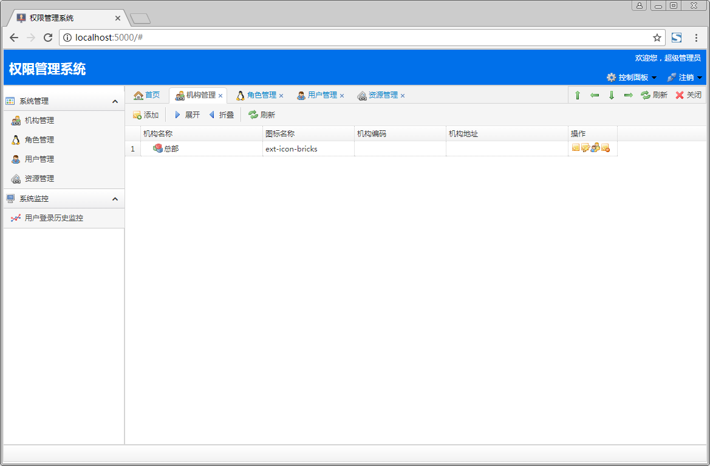
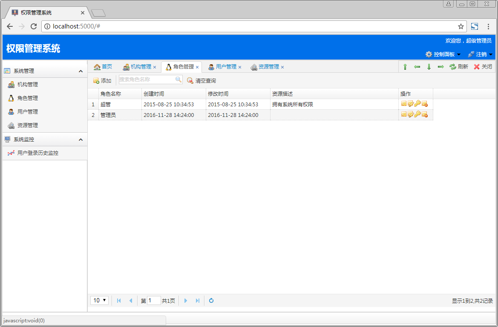
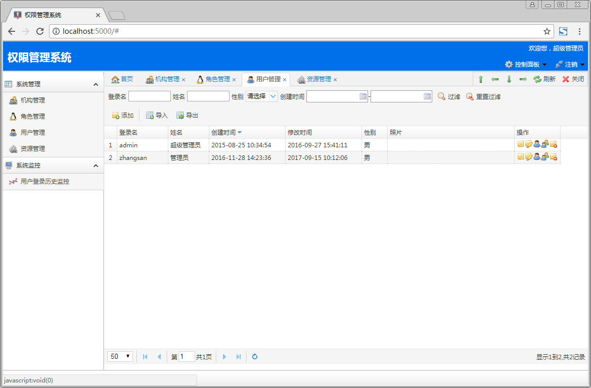
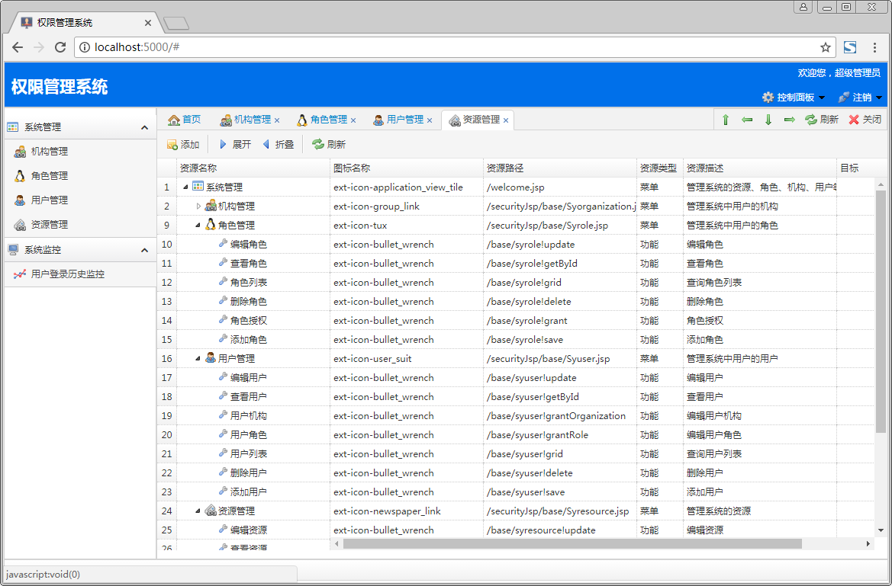

#基于Flask实现后台权限管理系统

基于Python的Flask WEB框架实现后台权限管理系统，内容包含：用户管理、角色管理、资源管理和机构管理。前端页面参考了@sypro。

**系统已经切换python 3，我的是在python 3.7.0下测试的，理论上Python 3版本应该都是可以运行的。需要Python 2版本的朋友可以checkout到python2分支。**

**前端依赖插件**

 1. My97DatePicker
 2. jQuery
 3. Bootstrap
 4. jQuery EasyUI
 5. jQuery Portal
 

**后端依赖插件**

 1. Flask
 2. Flask-Migrate
 3. Flask-Script
 4. Flask-SQLAlchemy
 5. Flask-Login
 6. itsdangerous
 7. Jinja2
 8. Werkzeug
 9. mysql-python

**使用方法**

1. 导入根目录下db.sql数据库脚本到mysql数据库
2. pip install -r requirements.txt。本项目下的flask是下载好的依赖，在python环境下可以直接运行。
3. python manager.py runserver

**效果图**

